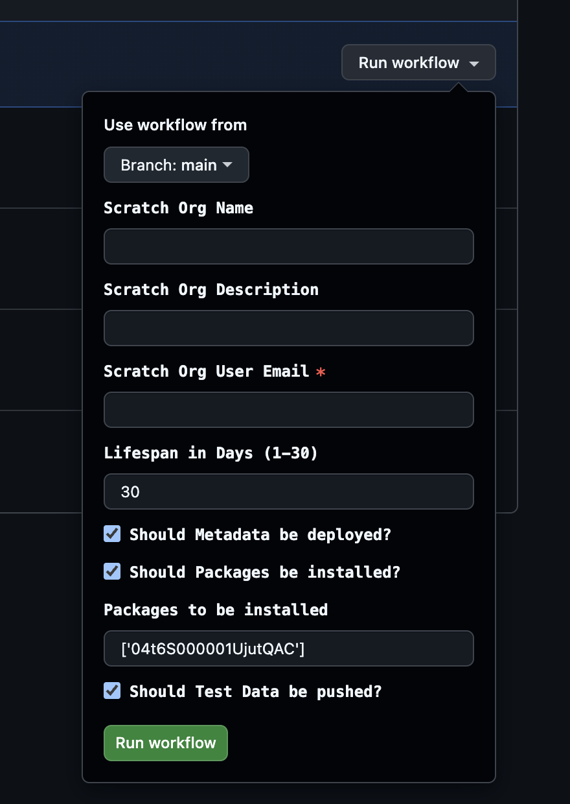

# 🌇 DevOps Dreamin' London 2025 - Demo

## Scratch Org Self-Service with GitHub Actions

This repository serves as the basis for a demo during the DevOps Dreamin' London 2025 and can also be used as a blueprint for implementing a Salesforce self-service for automated Scratch Org creation.

### Purpose of the Scratch Org Self-Service

One of the biggest challenges in implementing modern DevOps practices in the Salesforce ecosystem is the cross-functional nature of the related teams with varying levels of technical expertise in this area. To be able to still make DevOps a shared responsibility of a team, it's crucial to make all the associated tools and concepts as accessible as possible for everyone. Especially when using Scratch Orgs, challenges often arise, as their creation typically requires the use of tools like VS Code and the Salesforce CLI. Therefore, a self-service concept can increase accessibility.

### How the Scratch Org Self-Service works

You can find the [Self-Service in the Actions tab of this repo](https://github.com/svierk/devops-dreamin-london-2025/actions/workflows/create-scratch-org.yml) which allows you to request a new Scratch Org by entering simple parameters as configuration via the following form:

The implementation in the associated [create-scratch-org.yml](https://github.com/svierk/devops-dreamin-london-2025/blob/main/.github/workflows/create-scratch-org.yml) file is located in the `.github` directory under `workflows`. This includes the definition of necessary process steps such as authorizing the DevHub, creating the org, installing packages, and provisioning test data.

### GitHub Actions that simplify building your Salesforce DevOps Setup

Below you will find a number of freely usable actions I created to simplify the process of building individual DevOps setups using GitHub Actions. Essentially, they are like building blocks that abstract away the complexity of the Salesforce CLI and serve different purposes. They were also used in the Scratch Org Self-Service in this repository:

- [🕵🏻 Get Node Version](https://github.com/svierk/get-node-version)
- [⚙️ SFDX CLI Setup](https://github.com/svierk/sfdx-cli-setup)
- [🔐 SFDX Login](https://github.com/svierk/sfdx-login)
- [🌩️ SFDX Create Scratch Org](https://github.com/svierk/sfdx-create-scratch-org)
- [📦 SFDX Package Installation](https://github.com/svierk/sfdx-package-installation)
- [💾 SFDX Data Import](https://github.com/svierk/sfdx-data-import)